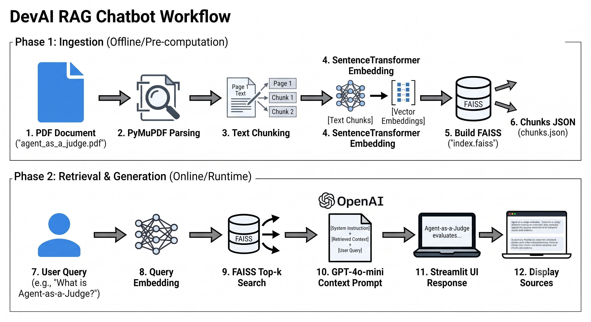

# 🤖 DevAI Agent-as-a-Judge RAG Chatbot

## Project Overview
This repository contains a specialized Retrieval-Augmented Generation (RAG) chatbot designed to evaluate and query the *Agent-as-a-Judge: Evaluate Agents with Agents* research paper. Engineered by Sahil Raj (Roll No. 221MN045, National Institute of Technology Karnataka), this system implements a hybrid search pipeline combining FAISS dense vector retrieval and BM25 sparse keyword matching. It leverages a structured Chain-of-Thought prompt and a deterministic LLM configuration to ensure exact extraction of dataset metrics, cost comparisons, and alignment rates from the DevAI benchmark without hallucinations.

## System Architecture Workflow
Below is the data pipeline and RAG architecture, covering document ingestion, hybrid chunk retrieval, and generation:



## Installation & Execution Setup
To run this evaluation pipeline locally, ensure a Python 3.x environment is active and follow the deployment steps:

1. **Install Dependencies:** 
   ```bash
   pip install -r requirements.txt